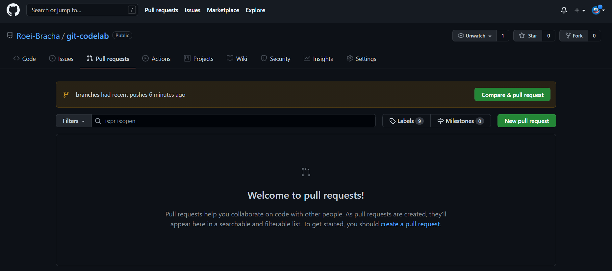
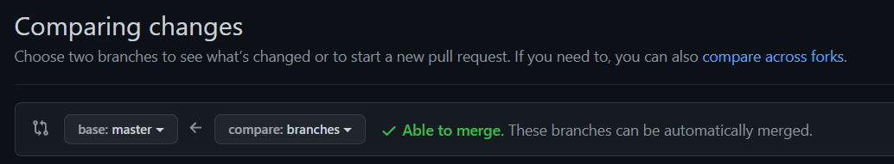
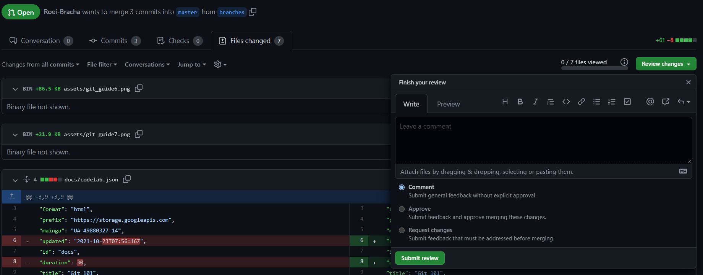
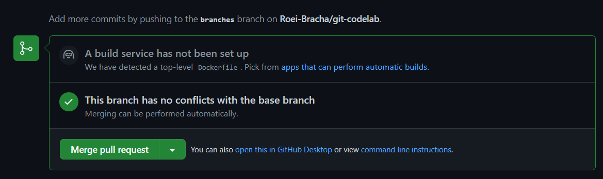

summary: First steps on Git
id: docs
categories: Git
tags: beginner
status: Published 
authors: Roei Bracha
Feedback Link: https://petetot.netlify.com


<!-- Trivia API: -->
<!-- https://opentdb.com/api_config.php -->


# Git 101
<!-- ------------------------ -->
## Intro
Duration: 00:00:00

In this session we will:
- create a GitHub account
- create a new repository
- practice commit, push and pull
- work on merges in pairs


This guide is a mix of a few tutorials with some notes from me
You can find the original tutorials in the links below:
- [https://opensource.com/article/18/1/step-step-guide-git](https://opensource.com/article/18/1/step-step-guide-git)
- [https://docs.github.com/en/authentication/connecting-to-github-with-ssh/testing-your-ssh-connection](https://docs.github.com/en/authentication/connecting-to-github-with-ssh/testing-your-ssh-connection)

<!-- ------------------------ -->
## Create a GitHub account
Duration: 00:05:00

The easiest way to get started is to create an account on [GitHub.com](https://github.com) (it's free).


Pick a username, enter your email address and a password, and click Sign up for GitHub. Once you are in, it will look something like this:


<!-- ------------------------ -->
## Install git
Duration: 00:05:00

make sure you have git install on your machine
To make sure, open the terminal and type ``` git help ```

if you get an error message download git from the sources blow:
- Windows - [http://git-scm.com/download/win](http://git-scm.com/download/win)

- Mac:
  - use brew with ```brew install git ```
  - http://git-scm.com/download/mac
- Linux:
  - Debian (Ubuntu): ```sudo apt-get install git```
  - Fedora: ```sudo yum install git```

<!-- ------------------------ -->
## Create and generate SSH key
Duration: 00:05:00

Using the SSH protocol, you can connect and authenticate to remote servers and services. With SSH keys, you can connect to GitHub without supplying your username and personal access token at each visit.

⚠️ This part can be scary, don't panic you only need to to this once for all your projects. ⚠️
<b>Don't be afraid to call for help if you need some</b>

1. Open Git Bash on windows or Terminal on Mac/Linux.
2. Paste the text below, substituting in your GitHub email address.
```ssh-keygen -t ed25519 -C "your_email@example.com"```
3. When you're prompted to "Enter a file in which to save the key press Enter. This accepts the default file location.
`Enter a file in which to save the key (/c/Users/you/.ssh/id_algorithm):[Press enter]`
your key location will be:
  - windows: `/c/Users/you/.ssh/`
  - Linux: `/home/you/.ssh/`
  - Mac: `/Users/you/.ssh/`
Keep press Enter until it's done
4. find your public key at the key location and copy the context of the file that end with `.pub` - you can open it with notepad.
you can also navigate to the folder using `cd <YOUR_PATH>` and then `ls` to see the list of all your files and then `cat <YOUR_FILE_NAME>.pub` .
<b>make sure to copy the public - </b> `.pub` <b> file</b> 

5. Go to GitHub and in the upper-right corner of any page, click your profile photo, then click Settings.

6. In the user settings sidebar, click SSH and GPG keys.

7. Click New SSH key or Add SSH key.

8. In the "Title" field, add a descriptive label for the new key. For example, if you're using a personal Mac, you might call this key "Personal MacBook Air".
9. Paste your key into the "Key" field.

10. Click Add SSH key. If prompted, confirm your GitHub password.

### Testing your SSH connection
 to check your SSH connection open Terminal (or git bush on windows) and write `ssh -T git@github.com`

 You may see a warning like this:
```
> The authenticity of host 'github.com (IP ADDRESS)' can't be established.
> RSA key fingerprint is SHA256:nThbg6kXUpJWGl7E1IGOCspRomTxdCARLviKw6E5SY8.
> Are you sure you want to continue connecting (yes/no)?
 ```
 then type `yes` and you should see:
 ```
 > Hi username! You've successfully authenticated, but GitHub does not provide shell access.
```
<!-- ------------------------ -->
## Create a new repository
Duration: 00:05:00

A repository is like a place or a container where something is stored; in this case we're creating a Git repository to store code. To create a new repository, select New Repository from the + sign dropdown menu.


Enter a name for your repository and click Create Repository.
If you want you can choose if your want your repository to be private.

Congratulations! You have set up your first repo on GitHub.com.

Once your repo is created, it will look like this:


<!-- ------------------------ -->
## Your first commit
Duration: 00:05:00

Open a new folder on your computer, this will be your code library for this codelab.
open this folder with Visual studio code (or any other IDE you like) and create a file called `readme.md` and write a nice message inside.

To tell your computer that Demo is a directory managed by the Git program, enter:
`git init`

Then, to tell the Git program you care about this file and want to track any changes from this point forward, enter:
`git add readme.md`

Positive
: if you want to add all the files in the directory you can call `git add .`

### Make a commit

So far you've created a file and told Git about it, and now it's time to create a commit.
Commit can be thought of as a milestone. Every time you accomplish some work, you can write a Git commit to store that version of your file, so you can go back later and see what it looked like at that point in time.
Whenever you make a change to your file, you create a new version of that file, different from the previous one.
To make a commit, enter:
`git commit -m "first commit"`

That's it! You just created a Git commit and included a message that says first commit.
You must always write a message in commit; it not only helps you identify a commit, but it also enables you to understand what you did with the file at that point.
So tomorrow, if you add a new piece of code in your file, you can write a commit message that says, Added new code, and when you come back in a month to look at your commit history or Git log (the list of commits), you will know what you changed in the files.

### Connect your GitHub repo with your computer

Now, it's time to connect your computer to GitHub with the command:
`git remote add origin <YOUR_REPO_URL>` you can find the URL on the github page
for example:
`git remote add origin https://github.com/<your_username>/Demo.git`

Let's look at this command step by step. We are telling Git to add a remote called origin with the address https://github.com/<your_username>/Demo.git (i.e., the URL of your Git repo on GitHub.com). This allows you to interact with your Git repository on GitHub.com by typing origin instead of the full URL and Git will know where to send your code.

### Push your code

to push your code and update it on Github just write: `git push -u origin master`

<!-- ------------------------ -->
## Clone, Branches and Marge
Duration: 00:10:00

### 👥 The following part will be in couples 👥

For this step find another person in the room and ask for the link to their Repository.
For now on you and you'r partner will work on the same repository.

### Clone

now press on the green code button and under clone you will see the SSH URL for the repository.


Next, on your local machine, open your bash shell and change your current working directory to the location where you would like to clone your repository. Note that here we are using a bash command - cd (change directory).

Once you have navigated to the directory where you want to put your repository, you can use:
`git clone git@github.com:microsoft/vscode.git`

This will download your friend repository to your computer, navigate inside that folder using `cd` commend.

### Branches

As we talked on the lecture we will never work on the master branch, so now you should create a new branch for your work.

👥 Each partner create his own branch to the same repository.

to create a new branch use the commend:
`git checkout -b YOUR_NEW_BRANCH_NAME`

💡 `git checkout` is used to switch between branches, the `-b` flag tell git it's a new branch.

Now go to the readme file and change the message inside it.
commit your changes as we learned before:
- `git add readme.md`
- `git commit -m "changing the read me"`

to update the repository with your new changes you need to use `git push`.
if this push will also create a new branch on the repository for the first time you should use:`git push --set-upstream origin YOUR_NEW_BRANCH_NAME`

### Merge

Positive
: To avoid conflicts,. Every time before we merge we will do the following steps:
* `git pull origin master` - Pull all the new changes to your local master.
* `git status` - Make sure you are in your branch.
* `git merge master` - Merge all the changes from master to your branch.
* Fix conflicts - Use an IDE for your help
* `git commit -m "fix conflicts"` -  Commit the conflicts fix
* `git push` - Push your new branch to the repository

Now on the the repository on github, go to the the pull request tab and press "New pull request"



Choose the branches you want to merge:


If you see the green message `Able to merge` you can create a pull request, if you don't so you probably have conflicts.
do the steps above again and refresh the page

### CR - code review

before we merge the changes to the main branch we will ask our friend to check our MR (merge request) or PR (pull request).
in his machine he can go to the pull requests tab and see all the changes from your PR.

To review your change your partner should enter the `File changed` tab and add comment if he finds something wrong.
After your partner read all the changes he can press the `Review changes` and approve or disapprove your PR.


### Merge to master
If your PR have been approved you can marge it by clicking the `Merge pull request` button on the `Conversation` tab


